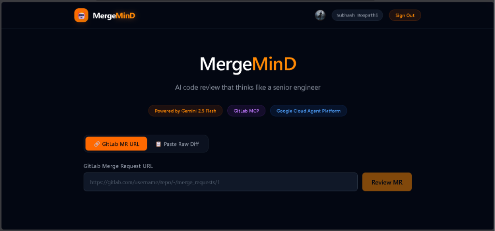
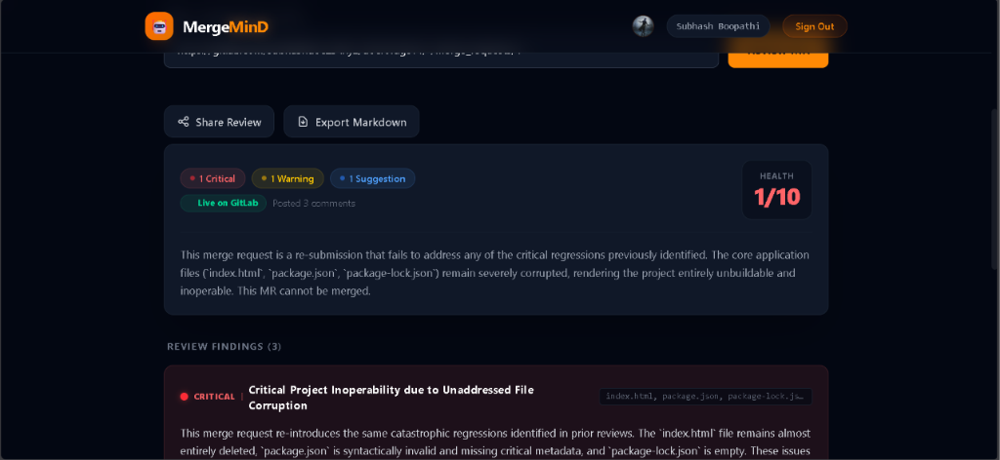

# MergeMinD
### AI code review that thinks like a senior engineer

[](https://deepmind.google/technologies/gemini/)
[](https://gl.roboco.dev/api/v4/mcp)
[](https://cloud.google.com/)
[](./LICENSE)
[](https://mergemind.vercel.app)


---

## Overview

MergeMinD is an AI-powered code review agent built for developers and teams looking to supercharge their review process on GitLab. By analyzing Merge Requests (MRs) or raw diffs with deep context, MergeMinD provides senior-engineer-level reviews covering bugs, code quality, security vulnerabilities, and actionable improvement suggestions, helping you merge with confidence.

---

## Features

- **Instant MR Analysis**: Paste any public or private GitLab Merge Request URL to trigger an automated, thorough review.
- **Raw Diff Review**: Directly paste code diffs for a quick, lightweight review without needing a GitLab repository.
- **OAuth Authentication**: Secure sign-in using Google and GitHub (with verified primary email extraction helper).
- **Persistent History**: View and access past reviews saved dynamically under each user profile in Firestore.
- **Detailed Actionable Insights**: Color-coded severity labels for issues: CRITICAL, WARNING, and SUGGESTION.

---

## Demo

### 1. Analysis Dashboard


### 2. Comprehensive Code Review Report


---

## Tech Stack

| Layer | Technology |
| :--- | :--- |
| **Frontend** | React 19, Next.js (App Router), TailwindCSS, TypeScript |
| **Backend/API** | Next.js Serverless Routes (Node.js runtime) |
| **AI Model** | Gemini 2.5 Flash |
| **Database** | Firebase Firestore |
| **Authentication** | Firebase Auth (Google & GitHub OAuth) |
| **MCP Integration** | GitLab MCP (Model Context Protocol) |
| **Mail Service** | Nodemailer (Gmail SMTP) |
| **Hosting** | Vercel |

---

## Architecture

```
User ──> Frontend (Next.js) ──> Backend (Serverless API) ──> Gemini 2.5 Flash ──> GitLab MCP ──> GitLab API
```

---

## Getting Started

Follow these steps to run MergeMinD locally:

### 1. Clone the Repository
```bash
git clone https://github.com/subhashdoc234xyz/mergemind-v4.git
cd mergemind-v4
```

### 2. Install Dependencies
```bash
npm install
```

### 3. Setup Environment Variables
Create a `.env.local` file in the root directory and define the required keys (see the [Environment Variables](#environment-variables) section below).

### 4. Run the Development Server
```bash
npm run dev
```
Open [http://localhost:3000](http://localhost:3000) in your browser.

---

## Environment Variables

| Variable Name | Description |
| :--- | :--- |
| `NEXT_PUBLIC_FIREBASE_API_KEY` | Firebase Web API Key for client app |
| `NEXT_PUBLIC_FIREBASE_AUTH_DOMAIN` | Auth domain for Google & GitHub sign-ins |
| `NEXT_PUBLIC_FIREBASE_PROJECT_ID` | Firestore & Firebase Project ID |
| `NEXT_PUBLIC_FIREBASE_STORAGE_BUCKET` | Cloud Storage bucket URL for Firebase |
| `NEXT_PUBLIC_FIREBASE_MESSAGING_SENDER_ID` | Sender ID for messaging services |
| `NEXT_PUBLIC_FIREBASE_APP_ID` | Firebase App Identifier |
| `NEXT_PUBLIC_FIREBASE_MEASUREMENT_ID` | Google Analytics Measurement ID |
| `GEMINI_API_KEY` | Google AI Studio Gemini API Key |
| `GITLAB_PERSONAL_ACCESS_TOKEN` | Personal Access Token with api scope access to read GitLab MRs |
| `GITLAB_API_URL` | Base API URL for GitLab (default: `https://gitlab.com`) |
| `GITLAB_MCP_URL` | Endpoint URL for the GitLab MCP Server |
| `GMAIL_USER` | Gmail address used as sender SMTP username |
| `GMAIL_APP_PASSWORD` | 16-character Google App Password for SMTP authentication |

---

## Usage

1. **Sign In**: Log in using your Google or GitHub account on the welcome screen.
2. **Review a Merge Request**:
   - Option A: Enter a GitLab MR URL (e.g., `https://gitlab.com/owner/repo/-/merge_requests/1`) and click **Submit**.
   - Option B: Paste a raw diff file contents into the Diff area and click **Submit**.
3. **Analyze Results**: Review the overall score, verdict, and the listing of critical bugs, security warnings, and refactoring recommendations.
4. **Share/Export**: Share the review using the generated short link or export it to Markdown.

---

## Roadmap

- [ ] Automated Slack and Microsoft Teams notification channels.
- [ ] Integration into GitLab CI/CD pipelines as an automatic MR review step.
- [ ] Custom system prompts to configure the persona/style of reviews (e.g. strict security check, stylistic check).
- [ ] Support for inline code suggestions/comments directly pushed back to the GitLab MR.

---

## Contributing

We welcome contributions! Please feel free to open issues or submit Pull Requests for bugs, new features, and design improvements. For major changes, please open an issue first to discuss what you would like to change.

---

## License

This project is licensed under the MIT License - see the [LICENSE](./LICENSE) file for details.

---

## Acknowledgments

Built for the **Google Cloud Rapid AI Agent Hackathon** (GitLab partner track), using Gemini 2.5 Flash and GitLab MCP capabilities.
